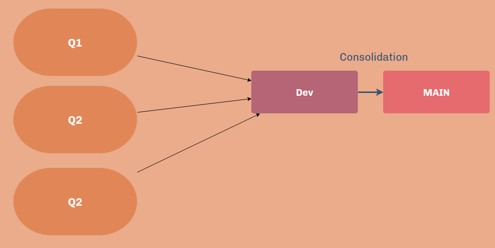

# Assignment Repository for CS6910

## Branch Workflow
 
 
  ### Description 
  - main: Final submission will be done via this branch.  
  - dev: Once the features/questions are completed, they will be merged to this branch. 
  - q<n>: individuals questions will be completed in these branches. n represents question number. 

## Contributors

student name: HARSHIT RAJ  
email: me19b110@smail.iitm.ac.in  
 
course: CS6910 - FUNDAMENTALS OF DEEP LEARNING  
professor: DR. MITESH M. KHAPRA  
 
ta: ASHWANTH KUMAR  
email: cs21m010@smail.iitm.ac.in   